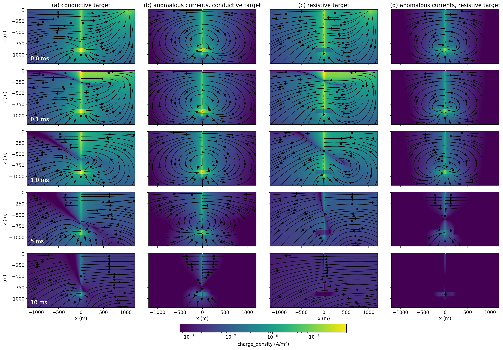

# Electrical and electromagnetic responses over steel-cased wells 

_Lindsey J. Heagy and Douglas W. Oldenburg_

https://doi.org/10.1190/tle41020083.1



# Summary

Electrical and electromagnetic (EM) methods can be diagnostic geophysical imaging tools for monitoring applications, such as carbon capture and storage or hydraulic fracturing. In these settings, it is common that steel-cased wells and other steel infrastructure are present. Grounded source methods, which use electrodes to inject current into the earth are of interest for casing integrity and monitoring applications. Electrostatic, or direct current (DC) resistivity, experiments form the basis of our understanding of the physics of grounded source experiments in terms of charges, currents, and electric fields. Steel-cased wells are highly conductive and although their presence makes numerical modelling more challenging, they can help targets of interest be detected because they channel charges and currents to depth. Time-domain EM experiments use a time-varying transmitter current. Understanding the EM response requires that we consider both galvanic, or DC currents, as well as image currents that are induced in the subsurface. As compared to DC experiments, the physics of EM is more complex because of the multiple current systems, as well as the need to consider magnetic permeability of steel-cased wells. However, EM experiments have the advantage that they can provide a large data set that is sensitive to a target of interest. Ultimately this will increase the potential for being able to extract information about the target. 

# Citation

Lindsey J. Heagy, Douglas W. Oldenburg; Electrical and electromagnetic responses over steel-cased wells. The Leading Edge 2022;; 41 (2): 83–92. doi: https://doi.org/10.1190/tle41020083.1

```
@article{heagy_electrical_2022,
    author = {Heagy, Lindsey J. and Oldenburg, Douglas W.},
    title = "{Electrical and electromagnetic responses over steel-cased wells}",
    journal = {The Leading Edge},
    volume = {41},
    number = {2},
    pages = {83-92},
    year = {2022},
    month = {02},
    issn = {1070-485X},
    doi = {10.1190/tle41020083.1},
    url = {https://doi.org/10.1190/tle41020083.1},
    eprint = {https://pubs.geoscienceworld.org/tle/article-pdf/41/2/83/5520626/tle41020083.1.pdf}
}

```
